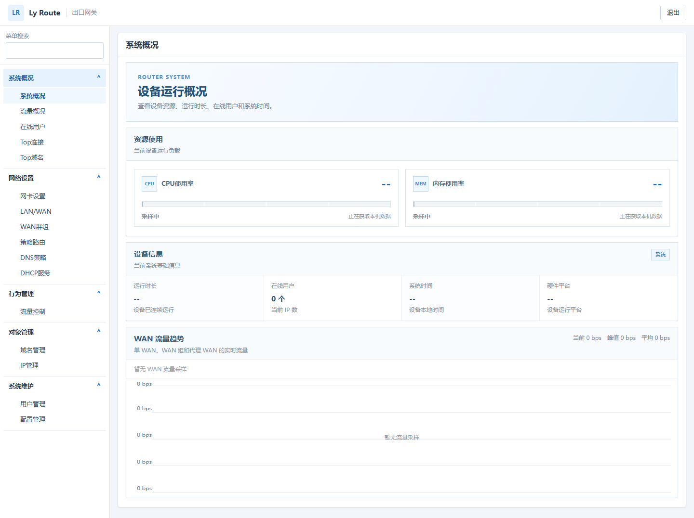
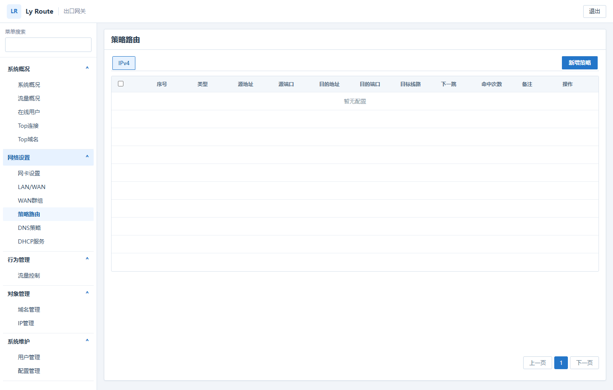

# Ly Route 出口网关 / Ly Route Gateway

## 中文

Ly Route 是面向 x86-64 路由设备和 Armbian Bookworm ARM64 设备的 VPP
出口网关。本仓库只维护出口网关；流量编排器迁移到独立仓库，不再共享本仓库的
产品边界、验收结论和发布产物。

主要能力包括 LAN/WAN、链路聚合、PPPoE、多 WAN、策略路由、Endpoint-dependent
和全锥 NAT、端口映射、TCP/UDP 53 透明劫持、DNS 策略、DHCP、代理 WAN、用户限速、
Smart QoS、安全策略、在线用户、连接和流量遥测。

`main` 每次完整构建成功后自动发布规范版本的 GitHub Release，包含 x86-64 ISO、
x86-64 升级包、ARM64 Armbian 一键安装包、ARM64 升级包和统一 `SHA256SUMS`。

文档：[白皮书](docs/whitepaper.md) | [架构](docs/architecture.md) |
[实现与验收状态](docs/implementation-status.md) | [验收契约](docs/product-functional-qa.md) |
[发布与安装](docs/release-and-installation.md) | [后续计划](docs/work-plan.md)

### 界面预览

## English

Ly Route is a VPP-based egress gateway for x86-64 appliances and ARM64 devices
running Armbian Bookworm. This repository contains the Gateway only. The traffic
orchestrator is maintained in a separate repository with independent scope,
validation and releases.

The Gateway provides LAN/WAN, bonding, PPPoE, multi-WAN, policy routing,
endpoint-dependent and full-cone NAT, port mapping, transparent TCP/UDP DNS
interception, DHCP, proxy WANs, rate limits, Smart QoS, security policy, online
users, connections and traffic telemetry.

Every successful `main` build publishes a versioned GitHub Release with an
x86-64 installer ISO, x86-64 upgrade, ARM64 Armbian one-click installer, ARM64
upgrade and unified `SHA256SUMS`.

Documentation: [Whitepaper](docs/whitepaper.md) | [Architecture](docs/architecture.md) |
[Status](docs/implementation-status.md) | [Verification](docs/product-functional-qa.md) |
[Release](docs/release-and-installation.md) | [Plan](docs/work-plan.md)

The screenshots above show the current system overview and policy-routing UI.
