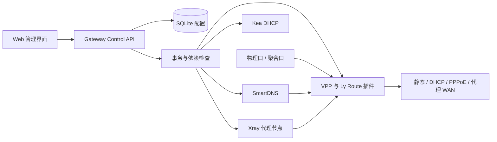
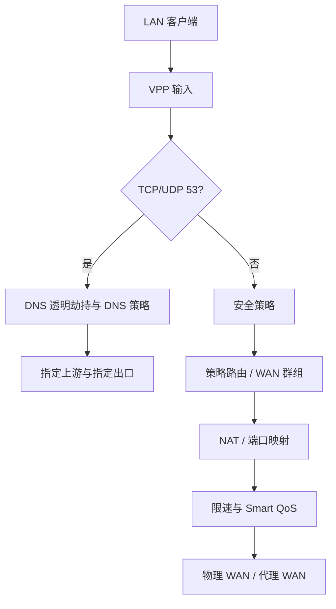
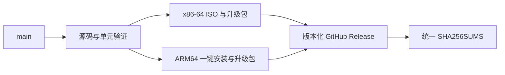

# 架构 / Architecture

## 中文

Ly Route 是单一出口网关产品。控制面由 Go API、SQLite、系统服务和 Web UI 组成；
数据面由 VPP 和项目自有插件组成。SmartDNS、Kea 和 Xray 只承担各自服务，不拥有
网关的全局路由决策。

数据口自动探测并选择设备级统一合格路径：VPP 原生高性能路径优先，DPDK/VFIO
作为回退。两者都不可用时锁定转发并保留管理面。AF_PACKET 仅允许实验室功能验证，
不属于生产路径。ESXi VMXNET3 验收使用 VPP TAP 与 Linux bridge 的兼容路径，且在
安装映射中明确标记为非高性能、仅验收。

管理口按 MAC/PCI 身份保存，默认静态地址为 `192.168.88.254/24`。当前安装器将
管理口留在 Linux；管理口虚拟化并与 LAN 数据口共享是后续工作，不得在未通过回滚
和失联保护前默认启用。

配置事务顺序为：输入校验、依赖检查、持久化、生成运行计划、应用、运行态回读、
失败回滚。DNS 策略优先于普通策略路由；业务分流由 VPP 负责，代理仅转发已选流量。

### 系统结构

### 报文与策略路径

### 发行链路

## English

Ly Route is one egress Gateway product. The control plane consists of the Go
API, SQLite, system services and web UI. VPP and project-owned plugins form the
data plane. SmartDNS, Kea and Xray provide bounded services and do not own global
routing decisions.

Data ports select one device-wide qualified tier: VPP-native high-performance
integration first, then DPDK/VFIO. Forwarding remains locked when neither is
qualified. AF_PACKET is lab-only. ESXi VMXNET3 acceptance uses a VPP TAP and
Linux bridge compatibility path explicitly marked non-production.

The management interface is persisted by MAC/PCI identity and defaults to
`192.168.88.254/24`. Configuration transactions validate, check dependencies,
persist, render, apply, read observed state and roll back on failure.

The diagrams above are normative at component-boundary level: the control API
owns transactions, VPP owns packet forwarding, and service processes own only
their bounded functions. DNS policy is evaluated before ordinary route policy.
