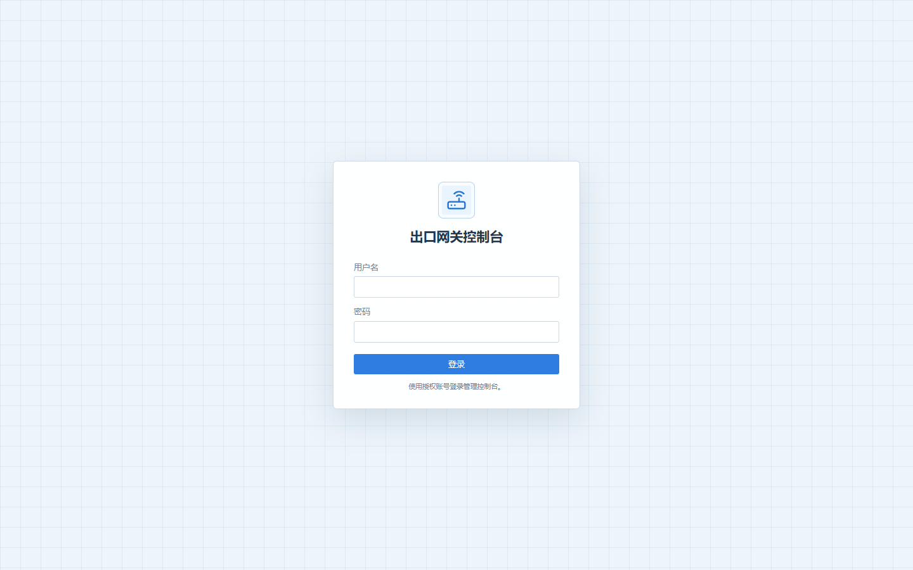
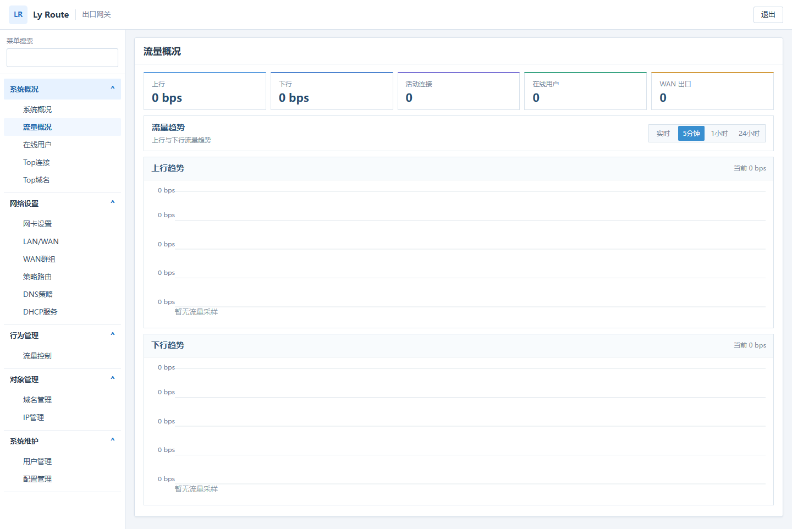

# Gateway UI Showcase

These images are visual references captured from the current Gateway frontend
bundle at a 1440x900 desktop viewport. The capture uses the frontend's explicit
mock-display mode only to render stable documentation images; it is not a
runtime fixture and is not included in production packaging.

The product UI uses router-user language, a white and light-blue visual
system, fixed table row heights, right-aligned primary actions, and stable
empty-state/page geometry. Runtime values are supplied by the Gateway API in
production.
