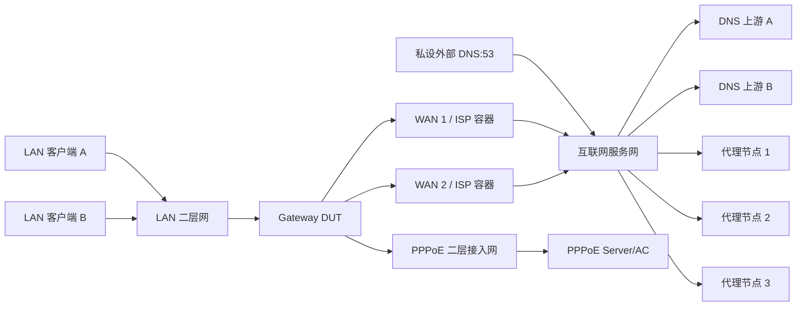
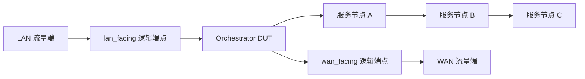

# 双产品全功能验收设计

本文档定义 Gateway 与 Orchestrator 的完整产品验收矩阵。容器网络是真实协议、包流和性能回归的主验收环境；浏览器、API/持久化和 rootfs/升级也必须各自通过。任何功能只有在所属层次全部通过后才能标记为“验收合格”。

## 1. 验收层次

| 层次 | 目的 | 典型环境 |
| --- | --- | --- |
| A. 契约与状态 | schema、API、权限、持久化、编译、事务、读回、回滚 | 普通 CI 进程/临时数据库 |
| B. 容器真实协议与包流 | DNS、DHCP、PPPoE、路由、NAT、代理、QoS、服务链和故障恢复 | rootful Linux、namespace、veth、bridge、macvlan/等价二层接口 |
| C. 浏览器 | 所有页面、类型化控件、权限、错误、空态、应用和真实状态 | Playwright 连接 B 层真实后端 |
| D. 系统产物 | rootfs 启动、systemd、安装、升级、回滚、恢复出厂、固件流程 | disposable VM/systemd-nspawn/等价系统容器 |

B 层缺少物理网卡或运营商线路不构成免测理由；虚拟二层网络和真实协议服务容器必须先完成全部功能语义。PPPoE NAT、64B 小包和路由性能使用受控容器拓扑持续记录，不得把虚拟化数据表述为物理线速。

## 2. 测试环境原则

- 在 rootful Linux Runner/测试机执行，具备 network namespace、`CAP_NET_ADMIN`、必要的 `/dev/net/tun`、hugepage 和 VPP 容器权限。
- 优先使用 network namespace、veth 和 Linux bridge 建立完全隔离、可重复的拓扑；需要容器表现为二层独立设备时使用 macvlan 或等价接口。
- PPPoE、DNS 上游、DHCP 客户端、代理节点、流量发生器、服务节点与被测设备必须位于独立容器/命名空间，禁止用同进程 mock 绕过网络。
- 用 `tc netem` 和受控瓶颈注入延迟、抖动、丢包、限速、乱序、端口 down 和链路中断。
- 被测对象使用本次提交构建的正式产品 rootfs，启动正式控制 API、VPP、受控 DNS/代理服务接口、SmartDNS、Kea、Xray、pppd 和运行时适配器。`nftables` 不得出现在业务转发路径中。
- 每个功能必须同时验证成功、无匹配/空状态、非法输入、依赖失效、应用回滚、服务重启和设备重启后的行为。

## 3. Gateway 测试拓扑

## 4. DNS 权威优先级契约

DNS 控制不是普通策略路由中的一个附属字段，而是独立的、有序、首匹配决策引擎。容器测试必须证明以下顺序：

1. LAN 客户端发出的 TCP/UDP 53 默认先由 VPP 在入口分类并交给受控 DNS 服务接口；即使客户端手工配置外部 DNS，也不能绕过 DNS 控制。
2. DNS 接管优先于普通策略路由、默认路由和通用代理透明捕获；DNS 请求本身按照 DNS 规则选择的固定 WAN、固定上游或代理出口发送。
3. DNS 规则按用户排序首匹配即停止，支持精确域名、后缀、域名组和源客户端条件。
4. DNS 动作只包括：选线/选上游解析、固定应答、拒绝/NODATA。DNS 规则本身不拥有 NAT、普通下一跳或通用路由动作。
5. 如果 DNS 规则选择线路 A，而普通策略路由选择线路 B，则 DNS 查询走 A；对该应答所解析 IP 的后续业务流量，在 TTL 有效期内也继承 A。TTL 到期后才恢复普通策略路由计算。
6. DNS 选择代理时，DNS 请求本身必须进入代理路径，不能只代理解析后的业务流量。
7. 未匹配任何 DNS 规则时返回 `NOERROR/NODATA`，不得偷偷使用默认上游；UI 不自动创建或暗示一个 `any` 放行规则。
8. 已匹配规则的上游、固定线路或代理不可用时返回 NODATA/明确失败，不继续尝试低优先级 DNS 规则，也不回落到普通路由默认出口。
9. TCP 53 与 UDP 53 语义一致；IPv4/IPv6 在产品支持范围内分别验证。DoH/DoT 不属于“53 端口默认接管”，除非后续单独定义。
10. SmartDNS 缓存、DNS→IP 集、TTL 到期、负缓存、服务重启和规则更新后不得保留过期选路绑定。

### DNS 必测场景

| 场景 | 配置/冲突 | 必须证明 |
| --- | --- | --- |
| 默认 53 接管 | 客户端指定私设外部 DNS | 私设 DNS 收不到客户端直发请求，SmartDNS 收到并审计请求 |
| 固定 WAN | DNS 规则选 WAN 1，PBR 选 WAN 2 | DNS 请求和 TTL 内关联业务流走 WAN 1 |
| 固定上游 | 同一线路部署上游 A/B | 只访问规则指定上游，源地址和出口正确 |
| 代理 DNS | DNS 规则选代理，普通 PBR 选直连 | DNS 请求本身进入 Xray/代理节点，不能直连泄漏 |
| 固定应答 | 规则配置固定 A/AAAA | 返回指定答案，不访问任何上游 |
| 拒绝/黑名单 | 精确、后缀和域名组命中 | 返回 NODATA/规定拒绝结果，无上游请求 |
| 规则顺序 | 高低两条规则都匹配 | 只执行首条，不合并、不继续 |
| 未命中 | 无匹配规则 | NOERROR/NODATA，不使用默认上游 |
| 命中但线路失效 | 首条选 WAN 1 且 WAN 1 down，次条可用 | 不落到次条/WAN 2，返回明确失败并告警 |
| TTL 选路 | DNS 选 WAN 1，PBR 选 WAN 2 | TTL 内业务流走 WAN 1；到期并清除绑定后走 WAN 2 |
| TCP/UDP 与双栈 | UDP 截断转 TCP、A/AAAA | 两种传输均被接管，缓存和选路不串扰 |
| 规则更新 | 下载规则、校验和失败/成功、回滚 | 失败不切换；成功原子切换；可恢复上一版本 |
| Top Domains | 多客户端、多域名、缓存命中 | 排名、计数、时间窗、过期/不可用状态准确且有界 |

## 5. Gateway 全功能矩阵

| 功能域 | 容器/API/浏览器必测内容 | 关键故障与证据 |
| --- | --- | --- |
| 产品隔离与能力 | Gateway profile、服务、资源、菜单、API 白名单 | Orchestrator 专属资源不可见；越界 API 返回确定错误 |
| 登录、用户、权限、审计 | admin/readonly、建删用户、改密、会话过期、敏感字段脱敏 | 未授权/越权拒绝；每次变更有操作者、修订和结果 |
| 管理网络保护 | 管理口改址、业务角色/Bond 排除、数据面锁定时访问 | 错误配置和 VPP/DPDK 失败不能接管或切断管理口 |
| 接口与 Bond | 发现、重命名、角色、静态/DHCP IPv4/IPv6、Bond 创建/成员/删除 | 成员 down/up、重复成员、管理口成员、重启读回 |
| LAN/WAN | 静态/DHCP、网关、MTU、DNS 来源、链路状态 | 地址冲突、DHCP 超时、网关不可达、链路恢复 |
| WAN 群组 | 主备、加权、五元组；禁止代理成员 | 多连接分布、粘滞、主链路 down/recover、组成员变化、回程 |
| 策略路由 | 顺序、`any`、单 IP、CIDR、范围、IP 组、协议/端口、单 WAN/WAN 组/代理、纯路由/NAT 动作 | 首匹配、移动、悬空引用、无匹配不合成隐式路由；DNS 优先级冲突按第 4 节 |
| NAT44 | 源 NAT、静态 NAT、端口映射、协议和端口范围、回程 | 冲突映射、WAN down、会话清理、回滚；不出现 NAT66/UPnP |
| DNS | 第 4 节全部场景 | pcap、SmartDNS 日志、DNS→IP TTL 集、VPP 服务转交/回注计数器和出口抓包一致；不得使用 nftables redirect 作为通过依据 |
| DHCP/Kea | 多 LAN/多子网、地址池、租期、网关/DNS 选项、静态绑定、租约/在线用户 | Discover/Offer/Request/Ack、续租/释放、池耗尽、冲突、错误绑定、Kea 重启恢复 |
| PPPoE | 发现、PAP/CHAP、拨号、IPv4/IPv6CP、地址/DNS/默认路由 | 密码错误、AC 不可用、断线、自动重拨、路由撤销/恢复、日志脱敏 |
| 代理出口 | 节点/订阅增删、秘密脱敏、underlay、固定节点、最快节点、TProxy 和 DNS 联动 | RTT/抖动/协议失败、失效切换、防抖、恢复、订阅失败回滚、无 DNS 泄漏 |
| 策略限速 | 按接口、IP/CIDR/范围/IP 组/策略的上下行限速 | 精度、并发、公平性、规则顺序、应用/回滚/重启 |
| 智能 QoS | 双向跑满并发 ping、DNS、短连接、语音/交互流 | 空载/满载 RTT、p95/p99、抖动、丢包、吞吐、公平性、CPU/内存；证明未绕过 VPP |
| ACL/安全 | ACL 顺序、IPv4/IPv6、协议/端口、IP-MAC 绑定、威胁名单、基础攻击规则 | 放行/拒绝计数、伪造 IP/MAC、名单更新失败/回滚；不存在 DPI/OAF 入口 |
| IP/域名对象 | `any`、主机、CIDR、范围、IP 组、域名组、导入/导出、嵌套、引用 | 循环、逐行错误、重命名、删除保护、展开预览、TTL 更新 |
| 遥测 | 总览、接口、5m/1h/24h、Top 会话/域名/用户/策略、逻辑出口 | underlay 不重复计数、时钟窗口、持久化、过期/不可用、重启连续性 |
| 运行时事务 | preview/apply/readback/receipt/rollback/reconcile | VPP/SmartDNS/Kea/Xray 任一步失败均不产生半配置；漂移和重启可修复 |
| 配置维护 | 导入导出、快照、恢复、跨产品拒绝、恢复出厂 | 坏文件、旧版本迁移、断点失败、秘密保护、恢复后真实包流一致 |
| 固件/RootFS | 暂存、哈希/签名、安装、启动、失败回滚、卸载 | 使用 disposable VM/systemd 容器验证服务、迁移、断电点和版本兼容 |
| UI 全页面 | 19 个现有页面、不移动内容位置、类型化选择器、浅蓝白视觉、三视口 | 成功/失败/空态/权限/加载/长文本；页面状态来自真实后端，不用假数据 |

## 6. PPPoE、DHCP 与客户端联动场景

- PPPoE Server/AC 容器真实提供发现、认证、会话、IPv4 地址、IPv6CP/前缀能力和 DNS 信息；Gateway 必须运行正式 pppd 流程，不得直接注入“已连接”。
- PPPoE 获得的 WAN、普通 DHCP WAN 和静态 WAN 分别进入 DNS 固定线路、WAN 群组、PBR、NAT 和代理 underlay 场景，证明接口来源不会改变上层语义。
- LAN 客户端通过 DHCP 获得 Gateway 地址和本机 DNS 地址，然后尝试改为外部 DNS，证明默认 53 接管仍生效。
- Kea 静态绑定、动态租约和在线用户必须共享稳定客户端身份；租约变化后 ACL、QoS、DNS 源条件和遥测不得指向错误用户。

## 7. Orchestrator 全功能矩阵

| 功能域 | 必测内容 | 关键故障与证据 |
| --- | --- | --- |
| 产品隔离 | Orchestrator profile、API、数据库、菜单和服务 | NAT、DNS/DHCP、PPPoE、代理、域名对象、DPI/OAF 均不可见/不可调用 |
| 管理口 | 独立 Linux 管理网络、改址、数据面锁定时访问 | 任何逻辑端点/Bond/DPDK 配置不得接管管理口 |
| 逻辑接口 | 物理口和 Bond 两种端点、角色、成员、状态 | 成员 down/up、重叠成员、跨组复用和管理口成员拒绝 |
| 编排组 | 两个不同逻辑端点、LAN/WAN 方向、启停 | 端点冲突、半组、重启和删除引用保护 |
| IP 对象 | `any`、主机、CIDR、范围和 IP 组 | 导入、嵌套、循环、引用、删除；明确无域名入口 |
| 策略组/规则 | 公共条件、顺序、移动、源/目的、协议、端口、`via/direct/drop` 和默认动作 | 首匹配、无匹配、坏引用、并发修订、确定性编译 |
| 服务节点/链 | 单节点、多节点、最多 8 跳、正向顺序和同实例严格逆序 | 重复节点、环路、顺序日志、pcap、VPP ACL/ABF 读回 |
| `direct`/`drop` | 直通与丢弃 | direct 不进入节点；drop 计数和原因准确 |
| 默认 bypass | 节点协议失败、进程退出、端口 down、恢复 | 原子移除失效节点；剩余链对称；无健康节点 direct；恢复防抖 |
| 安全/流控 | 安全拒绝先于流控，流控先于服务链 | 优先级冲突、计数、失败回滚；无 DPI/OAF |
| 遥测 | 接口、组、规则、链、节点、在线用户、Top 连接、24h 趋势 | 边界计数不重复、顺序/丢弃原因、过期/不可用、重启连续性 |
| 运行时事务 | preview/apply/receipt/readback/rollback/startup reconcile | VPP 重启、部分失败、配置漂移不形成单向链/半配置/环路 |
| 整机共同等级 | 全部活动端点与 Bond 成员统一原生或 DPDK 共同等级 | 任一必要接口降级时整机重选；无共同等级则全部锁定，管理口可用 |
| 配置/UI/产物 | 导入导出、快照、7 个现有页和目标新增页、x86/ARM 产物 | 跨产品导入拒绝、三视口、安装升级回滚、真实状态，无 Gateway 越界项 |

## 8. 自动化、覆盖追踪与证据

仓库维护一份机器可读的“功能—需求—场景—断言—证据”清单。每个权威产品功能必须至少关联：

- 一个合法 API/持久化/编译测试；
- 一个非法输入或权限测试；
- 一个真实运行时读回测试；
- 适用时一个容器真实协议/包流测试和一个故障恢复测试；
- 一个 UI 核心操作测试；
- 适用时一个 rootfs/升级门禁。

CI 必须保存产品、架构、提交和镜像/包哈希，拓扑与容器清单，API 请求/响应，运行时 receipt，VPP/服务读回，pcap、计数器、DNS/DHCP/PPPoE/代理/服务链日志，空载/满载指标，故障时间线，以及清理结果。测试结束不得残留 namespace、接口、规则、挂载或进程。

覆盖清单必须自动检测“设计文档新增功能但没有场景”以及“场景没有可执行断言”。完整矩阵任一必测项缺失、跳过或只有 mock 时，对应产品不得宣布全功能验收合格。

## 9. 验收用语

- A–D 层全部通过：可称“软件全功能验收合格”。
- A–E 层全部通过：可称“目标平台可发布”。
- 只有 schema、单元测试、页面、编译计划或 CI 绿灯：只能描述具体证据，不得称“功能已验收”。
